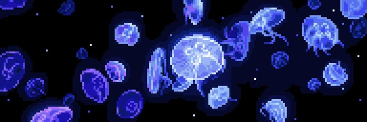
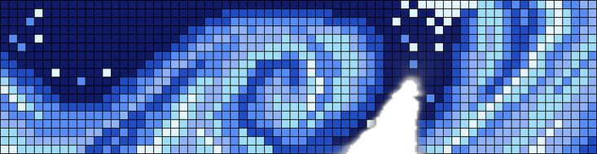

  

# Hi, I'm Georgie 👋

I'm a computing student interested in **quantum-hybrid AI development**, with a broader interest in artificial intelligence, quantum computing, post-quantum cryptography, and software development.

  

## 🔬 Interests

- ⚛️ Quantum computing
- 🤖 Artificial intelligence & machine learning
- 🔐 Post-quantum cryptography
- 💻 Software development
- 🧮 Mathematics
- ⚛️ Physics
- 🧪 Chemistry

## 💻 Technologies & Languages

### Currently using
- 🐍 Python
- 🔧 Git & GitHub

### Exploring
- 🌐 HTML & JavaScript
- C# & C++
- ☕ Java

## 🚀 What I'm Working Towards

Building my knowledge across software development, AI, and quantum computing, with the long-term goal of exploring how quantum and classical computing can work together in AI.
